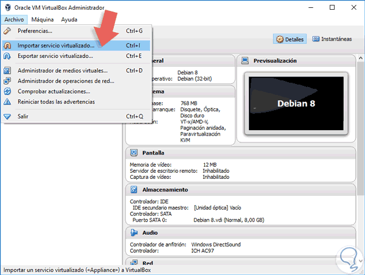
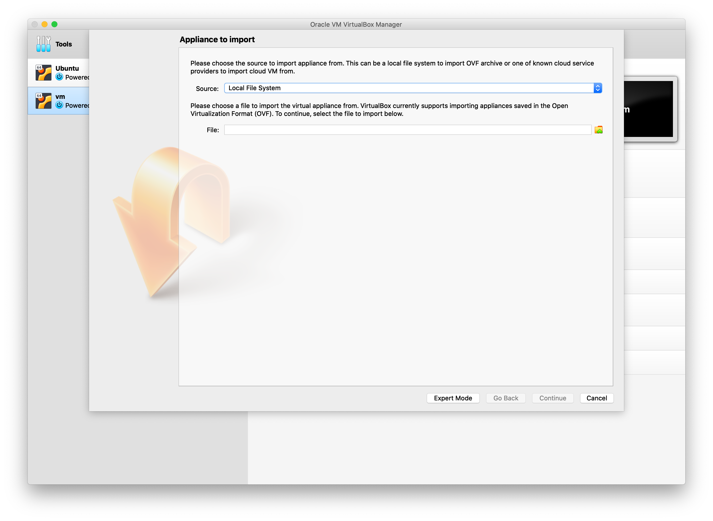
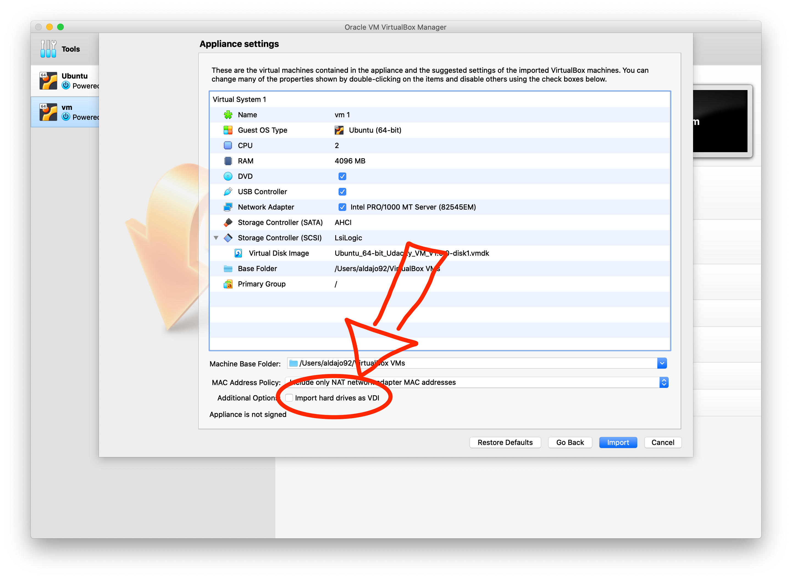

## Instalación de Maquina Virtual con ROS ##

Descargar la version de ROS que nos ofrece Udacity:

- [Descargar ROS](https://s3-us-west-1.amazonaws.com/udacity-selfdrivingcar/Udacity_VM_Base_V1.0.0.zip)

Descomprimir el archivo .zip, Luego realizar los siguientes pasos para importar la Maquina virtual:

- Contar con la ultima version de VirtualBox.
- Descomprimir la maquina virtual previamente descargada.
- Abrir VirtualBox.
- Seleccionar en (File -> Import Applience) o (Archivo -> Importar Servicio Virtualizado)

Luego agregar el archivo `.vdi` en el dialogo que se nos presenta:

Una vez agregado, asegurarse que la casilla para la importacion de los drivers NO este seleccionada:

