# Instalacion y configuracion de Ubuntu MATE en maquina virtual (Windows) #

Primero, leer un poco sobre la definicion de máquina virtual, para contextualizarse. 

[Máquinas virtuales: qué son, cómo funcionan y cómo utilizarlas](https://www.xataka.com/especiales/maquinas-virtuales-que-son-como-funcionan-y-como-utilizarlas).

## Proceso de instalación ##

Para instalar una maquina virtual en Windows, se debe seguir los siguientes pasos:

#### 1. Descargar Virtual Box. ####
Ir a la página de descargas de virtual box y descargar la última version, seleccionando la opción ```Windows host```.

[URL Virtual Box](https://www.virtualbox.org/wiki/Downloads)
#### 2. Instalar Virtual Box.

El proceso de instalación es similar a cualquier otro programa.

#### 3. Descargar la imagen de ubuntu 
Recomendamos usar la siguiente distribucion, por ser una de las mas livianas en la interfáz gráfica:
[Ubuntu Mate](http://cdimage.ubuntu.com/ubuntu-mate/releases/18.04/release/ubuntu-mate-18.04.3-desktop-amd64.iso).

Igualmente cualquier otra distribución es válida y los pasos de instalación son similares.

#### 4. Configurar la maquina virtual (VM). ####

Una vez se tenga instalado el programa Virtual Box, al abrirlo tendremos una interfáz como esta:

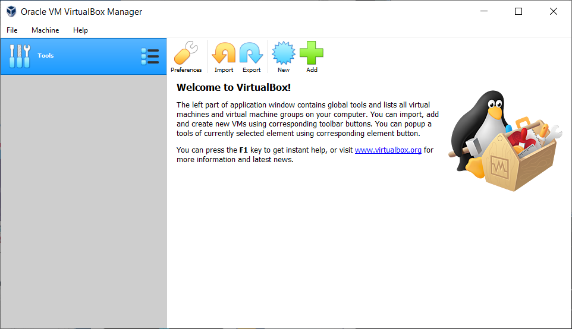

En la sección de la izquierda se observarán todas las máquinas virtuales, pero al momento no tenemos ninguna.

Seleccionamos la opción "New" o "Nuevo":


Y nos abrirá un dialogo similar al siguiente, donde podremos asignar un nombre a nuestra máquina virtual (Si seleccionamos el nombre asociado a la distribución, en este caso "Ubuntu",automáticamente nos configura el tipo y la version):

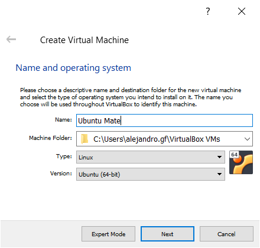

Recomendamos asignar el nombre tal como se mostró en el dialogo anterior y procedemos con el boton "Next" o "Siguiente". Se abrirá el siguiente diálogo:


Dependiendo de la cantidad de RAM presente en el equipo, se puede asingar una parte para la Máquina Virtual (Virtual Machine o VM). Recomendamos asignarle un tamaño no inferior a los 2048 MB. Igualmente este valor puede modificarse mas adelante según la necesidad (mostraremos el cómo mas adelante).

Procedemos luego con el botón "Next" o "Siguiente", y en el siguiente diálogo, dejamos la opción que se encuentra seleccionada sin hacer ninguna modificación.

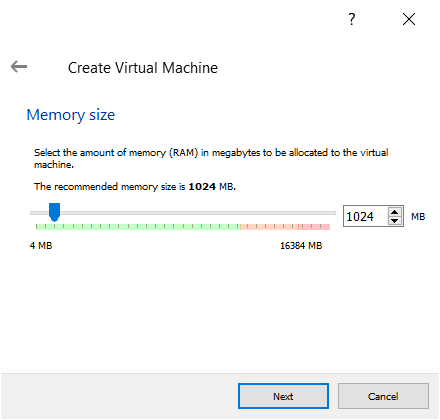

Seleccionamos en botón "Create" o "Crear".

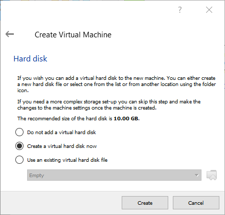

Dejamos la opción que se encuentra seleccionada en "VDI (VirtualBox Disk Image)". Y nuevamente seleccionamos el botón "Next" o "Siguiente".

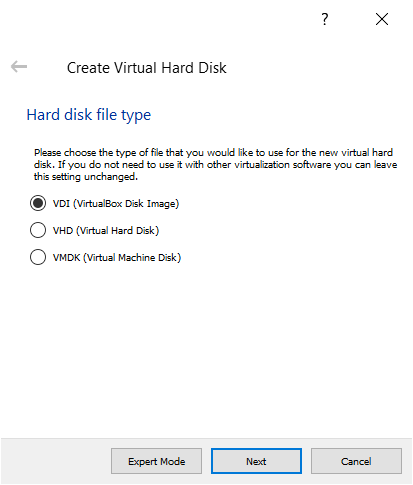

Dejamos la opción que se encuentra seleccionada en Dynamically allocated. Y seleccionamos el botón "Next" o "Siguiente".

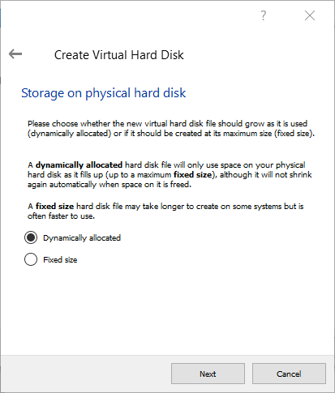

Dependiendo de la cantidad de memoria que se tenga disponible en el equipo (Cantidad de espacio disponible en disco duro), podremos seleccionar en este paso la cantidad de disco que le asignaremos a nuestra VM. Recomendamos asignar un espacio no inferior a 20 GB.

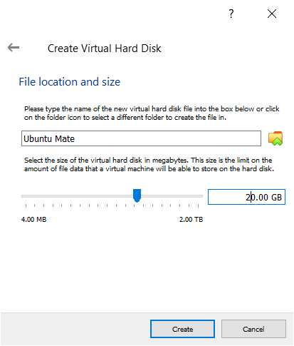

Seleccionamos el botón "Create" o "Crear". Y ya se puede visualizar en el panel izquierdo como se muestra a continuación:


En este punto solo hemos acondicionado los recursos necesarios para ejecutar nuestra VM, pero esta todavia no existe, porque debe configurarse como si se tratara de un equipo independiente.

#### 5. Instalar el sistema operativo en la VM. ####

Seleccionamos el icono "Setting" o "Configuración":


Y buscamos del lado izquierdo la sección "Storage" o "Almacenamiento" y seleccionamos la unidad vacía como se muestra a continuación:

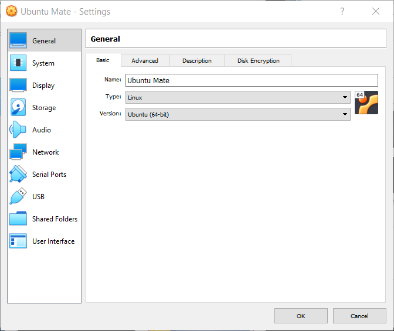

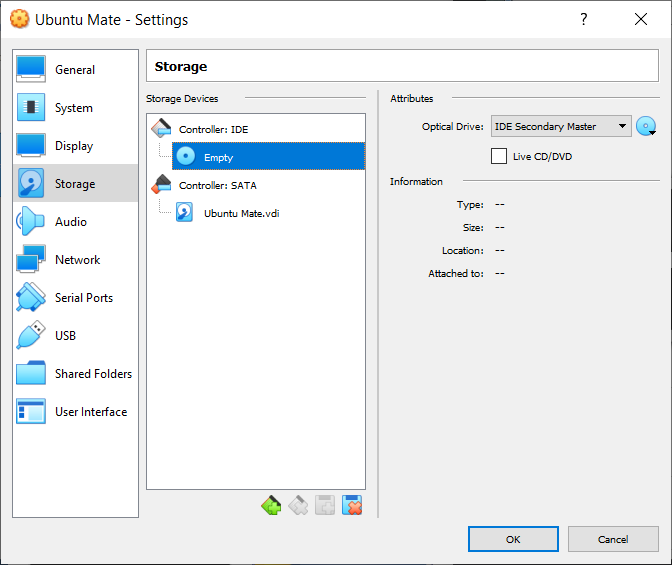

En esta sección podemos cargar la imagen que descargamos, el archivo con extension ".iso" para que la identifique como una unidad de cd/dvd. Para realizar tal operacion, seleccionamos el icono:


El cual se encuentra se encuentra en esta sección de la ventana.

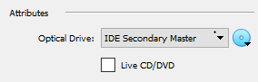

El cual nos pedira seleccionar el archivo ```.iso``` correspondiente a la imagen que descargamos previamente. Una vez seleccionada la imagen, verificamos que se encuentre visible en la seccion "Storage Devices" o "Unidades de almacenamiento" como se muestra a continuación:


Cerramos el dialogo y procedemos a iniciar la VM, seleccionando el siguiente icono:

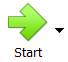

Esperamos unos momentos. Debe aparecer el siguiente diálogo que nos solicita seleccionar una sistema operativo de arranque, que para nuestro caso es la imagen que se cargo previamente.

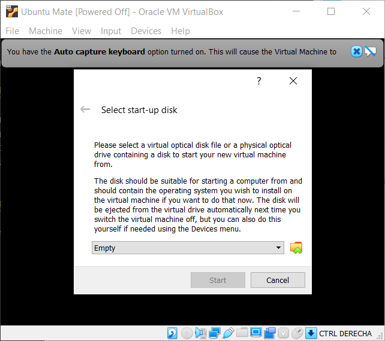

La seleccionamos de la lista que se despliega en el mismo diálogo:


Y nos deberia de aparecer algo similar a esto:

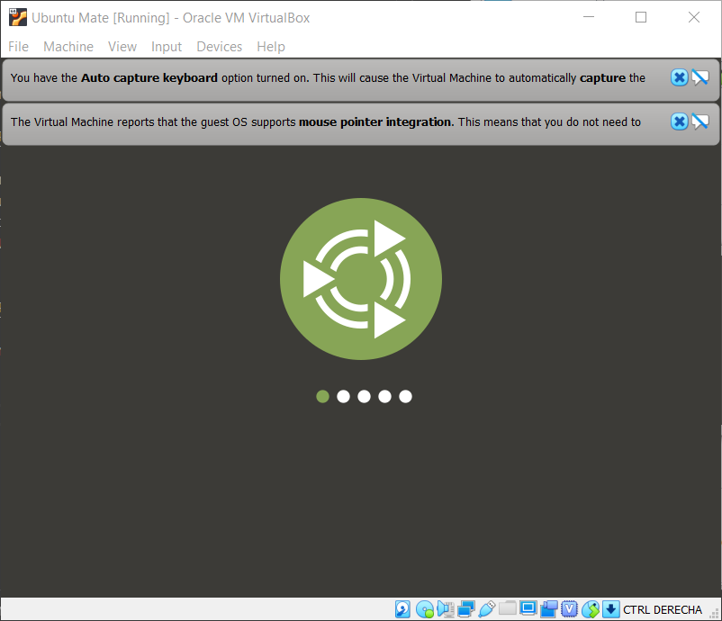

Luego de esperar, debe aparecer en la ventana de la VM un mensaje que nos pregunta si queremos probar el sistema operativo antes de instalarlo o proceder directamente a la instalación. Acá aconsejamos probarlo para verificar que todo funciona correctamente, por lo tanto presionamos en el botón "Try Ubuntu MATE":

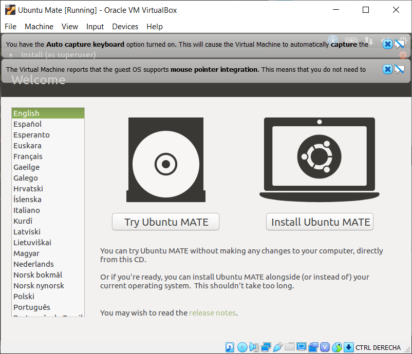

Observaremos un dialogo de bienvenida, el cual podemos cerrar.

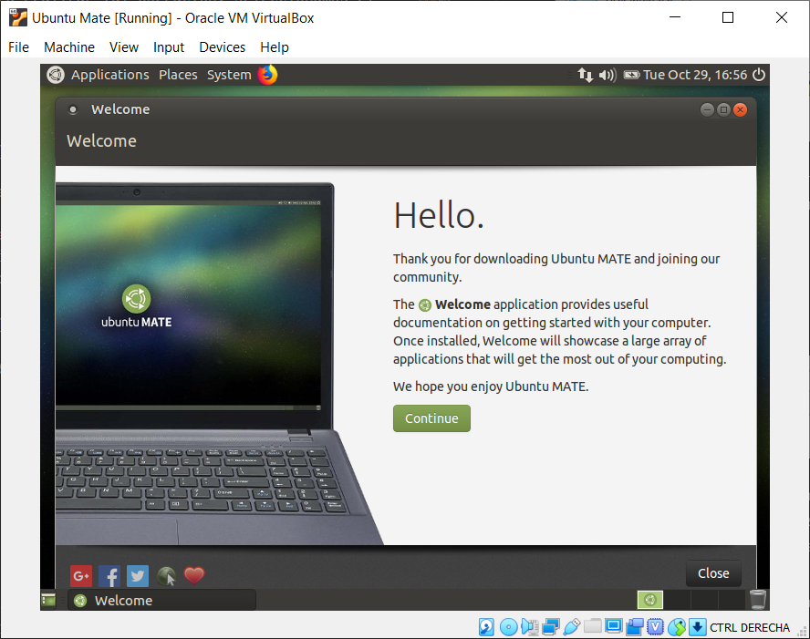

Una vez que verifiquemos que todo funciona correctamente (verificar que la conexión a internet funcione) procedemos a la instalación usando el ícono que se encuentra en el escritorio.

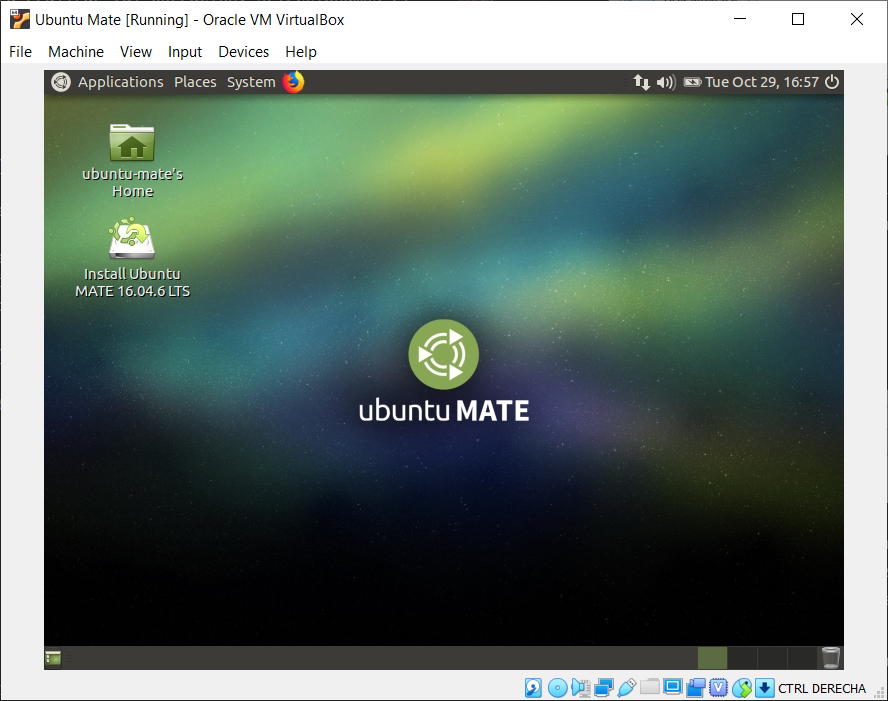

Nos abrirá un diálogo como el que sigue. Recomendamos configurar el sistema operativo en el idioma inglés por varias razones: 1) la mayoria de comandos por consola se encuentran en este idioma 2) los errores que se puedan presentar los podremos consultar y resolver facilmente buscando por el mensaje en este idioma, ya que hay mejor soporte. Presionamos en el botón "Continue".

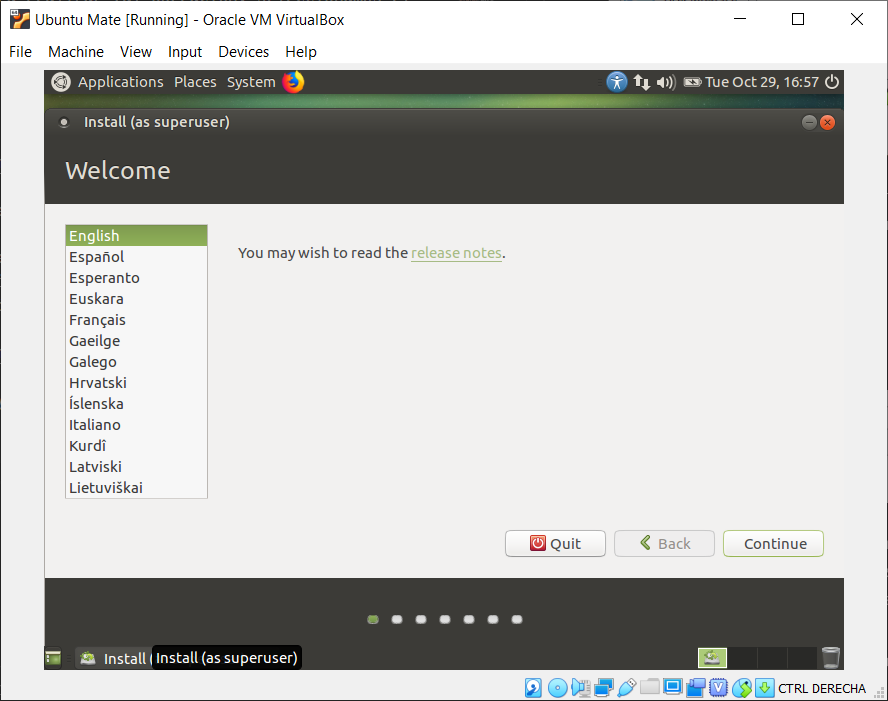

Seleccionamos los dos checks que aparecen y luego seleccionamos nuevamente el botón "Continue":

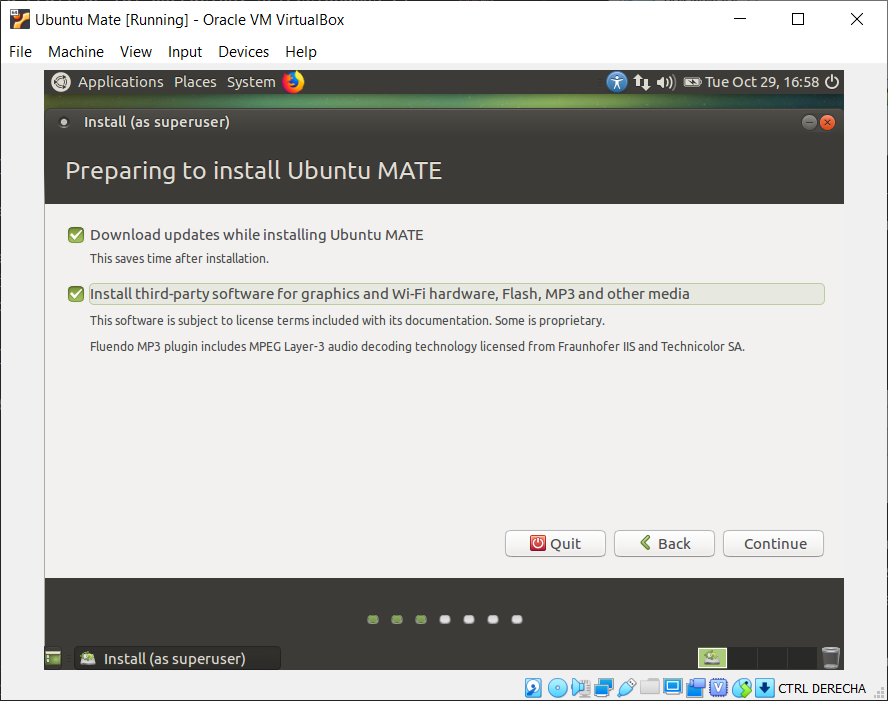

A continuación dejamos seleccionada la opcion "Erase disk and install Ubuntu MATE", y presionamos el botón "Install Now":

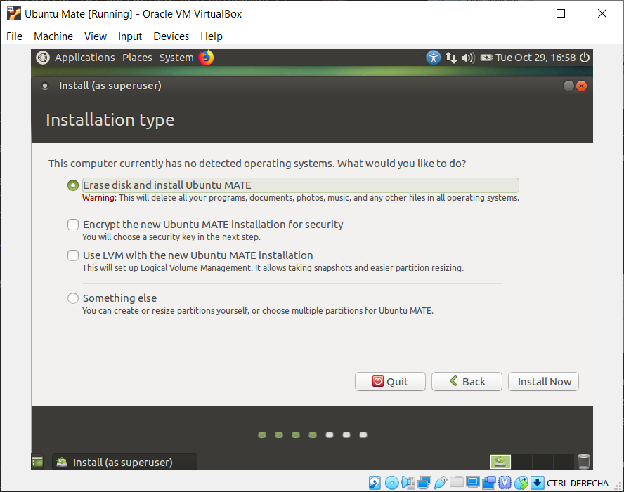

Aparecerá un dialogo donde nos pide confirmar (No se logró capturar para este documento) damos en "continue" o "confirm" según sea el caso. Luego empezará la instalación. Y mientras eso ocurre, nos preguntará por ciertas configuraciones:


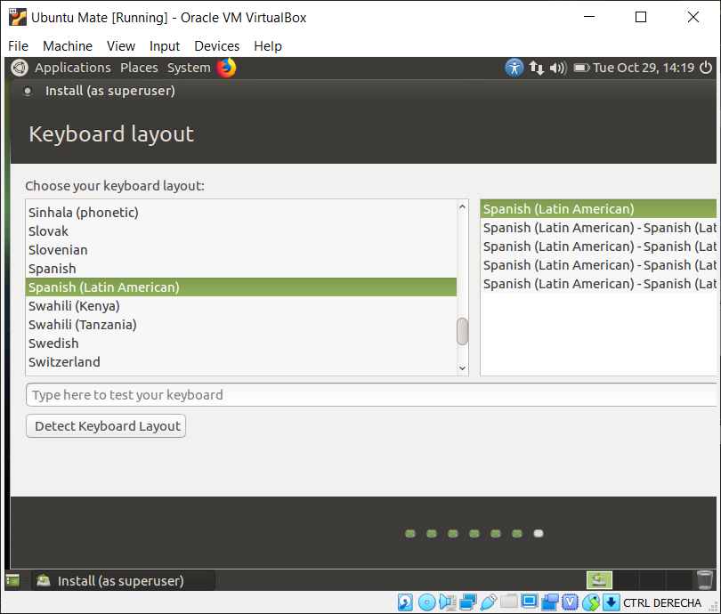

Ingresamos un nombre, nombre de máquina, un usario y contraseña. Al ingresar el nombre, algunos parametros se generarán automaticamente como sugerencia.

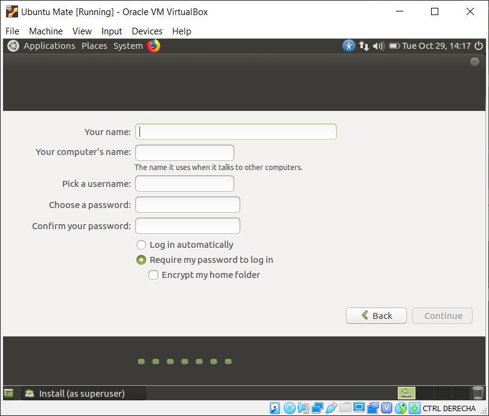

Al llenar los campos, seleccionamos el botón "continue".

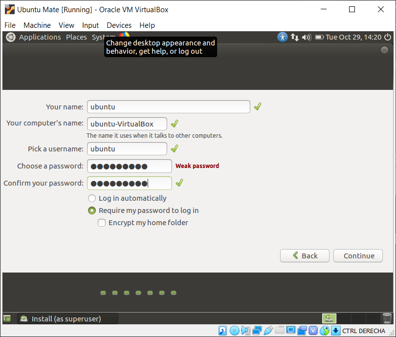

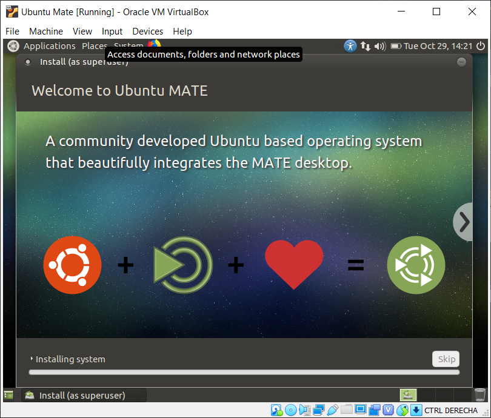

Una vez finalize la instalación aparecerá el siguiente mensaje:

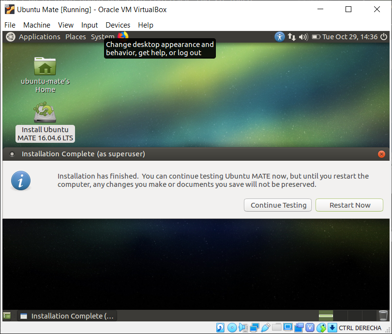

Procedemos con presionar en "Restart Now". Una vez aparezca el siguiente mensaje, presionamos la tecla "ENTER".

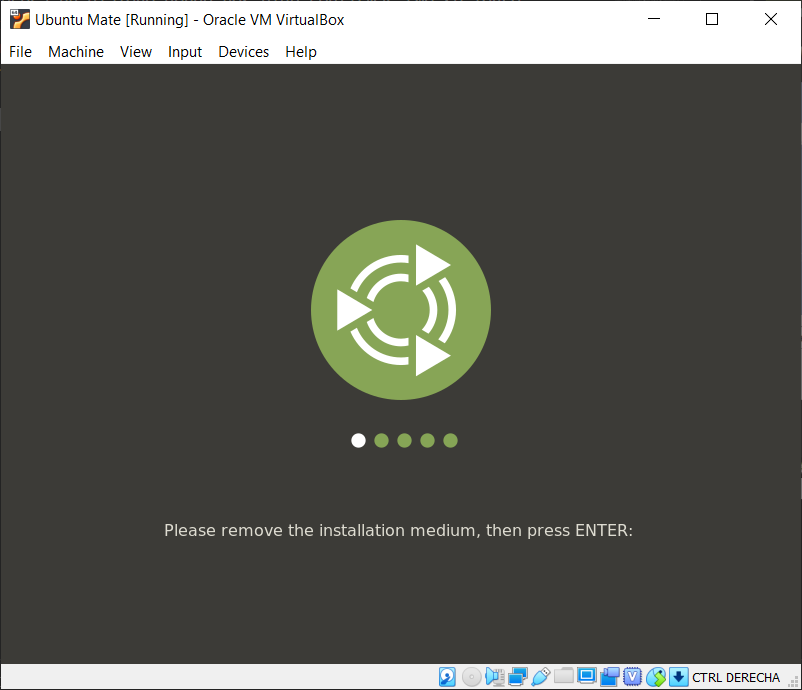

La máquina se reiniciará y podremos ingresar con el usuario y contraseña que préviamente asignamos.

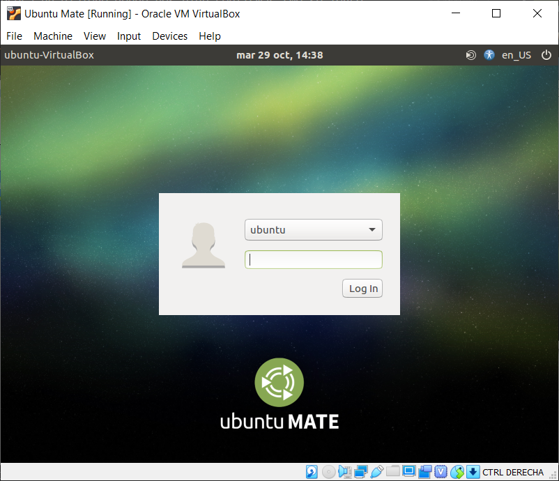