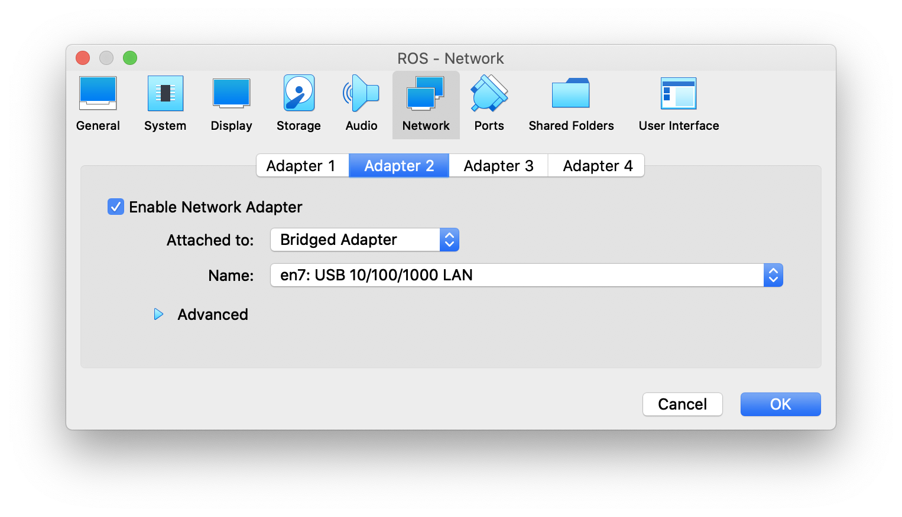
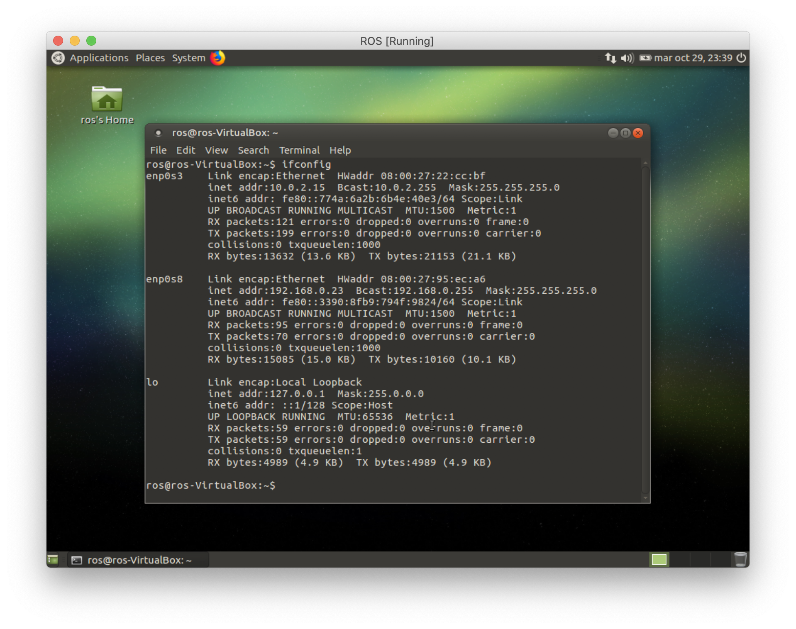
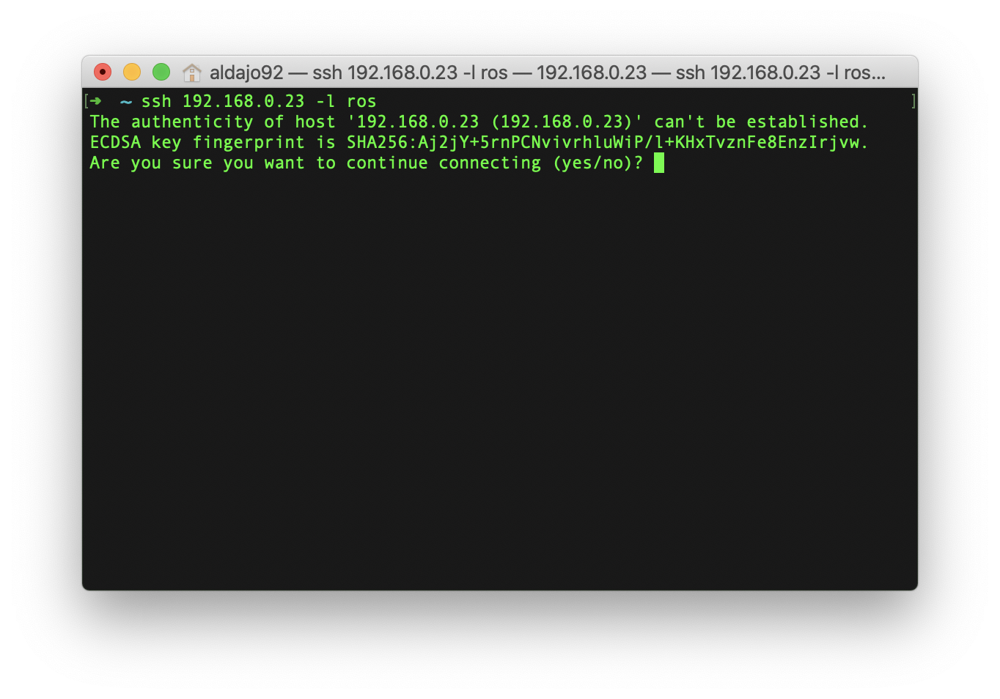
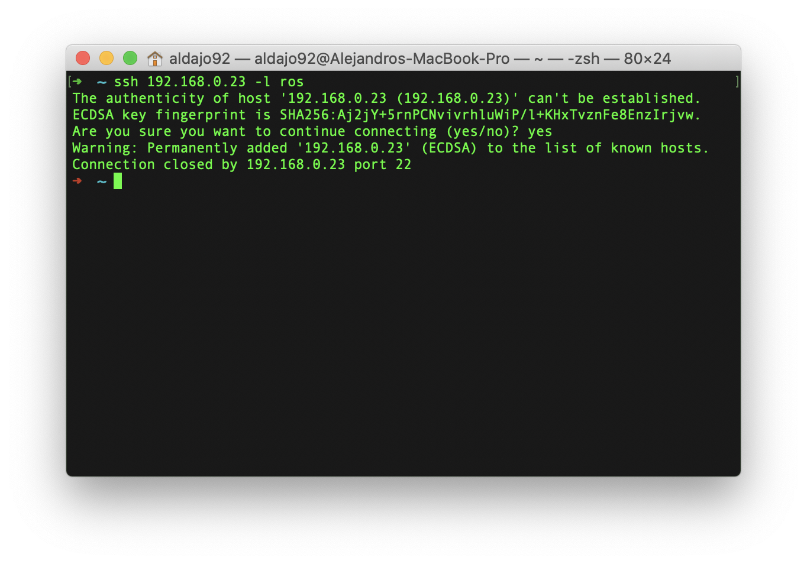
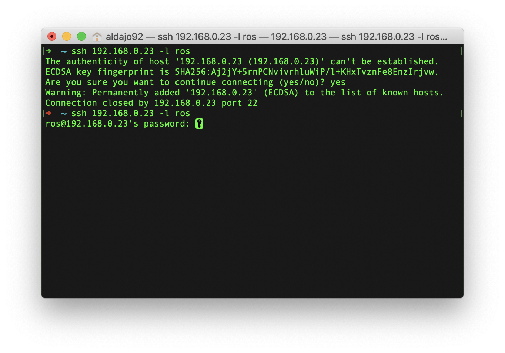
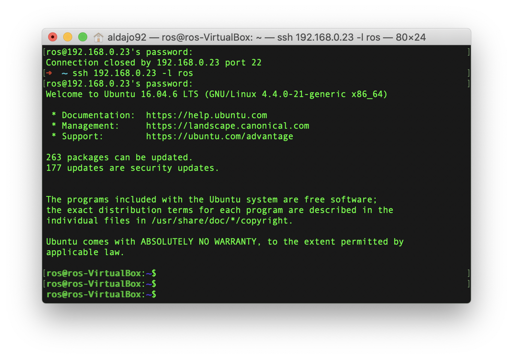

# Configuración SSH de la VM con Ubuntu MATE #

(Este procedimiento fue probado dentro del sistema operativo OSX. Pronto se realizará la respectiva validación en Windows)

Una vez se tenga instalada la máquina virtual, configuramos la red de la misma entrando a la opción de configuración:


Luego, en la ventana seleccionamos la opción ```Network```:


Y seleccionamos la pestaña ```Adapter 2 ``` y habilitamos la casilla ```Enable Network Adapter```. Adicionalmente debemos desplegar y buscar en la sección ```Attached to``` la opción ```Bridged Adapter```.



Dejamos el resto con la configuración por defecto y finalizamos con el botón ```OK```.

Corremos nuestra VM, iniciamos sesión y abrimos la consola con la combinación de teclas ```control + option + t``` y escribimos en ella:

```
~$ ifconfig
```

Que nos deberia desplegar algo como lo siguiente:



Debemos observar 3 interfaces de red: ```enp0s3```, ```enp0s8``` y ```lo```. Prestaremos atención a las dos primeras. La interfáz de red ```enp0s3``` corresponde a la red que simula la conexión cableada y siempre esta por defecto (al igual que ```lo```). La interfáz ```enp0s8``` corresponde a la conexion de puente que se configuró previamente, y que nos servirá para comunicarnos externamente usando el protocolo ssh.

Procedemos ahora con la instalación del ```openssh-server``` en la VM, con las siguientes instrucciones usando la consola:

```
~$ sudo apt update
~$ sudo apt install openssh-server -y
```

Una vez la instalación a finalizado, el servicio SSH iniciará automáticamente. Para verificar que la instalación fue satisfactoria y el servicio SSH se encuentre en ejecución, escribimos el siguiente comando:

```
~$ sudo systemctl status ssh
```

(Presionando la tecla ```Q``` cerramos el proceso que queda abierto en la consola)


para mas información sobre la configuración SSH, revisar la siguiente [guía de instalación](https://linuxize.com/post/how-to-enable-ssh-on-ubuntu-18-04/).

Ahora, desde nuestra consola (la del equipo, por fuera de la VM) nos podremos conectar a la VM usando el protocolo SSH. Para ello usamos la ip que nos arroja el comando ```ifconfig``` en la interfáz ```enp0s8``` que se mostró previamente, usando la siguiente instrucción, reemplazando ```<username>``` por el nombre del usuario:

```
~$ ssh 192.168.0.23 -l <username>
```

Un ejemplo sería como el siguiente:

```
~$ ssh 192.168.0.23 -l ros
```



Luego nos pedira confirmación por la autenticidad de la conexión que vamos a establecer, escribimos ```yes``` para confirmar.



Al primer intento no pasará nada, solo registrará la ip a la lista de hosts conocidos. Volvemos a ingresar la misma instrucción y aquí si nos pedira la contraseña que definimos para el sistema operativo de nuestra VM:



Al ingresar la contraseña, ya tendremos nuestra consola conectada a consola del sistema operativo de la VM:

