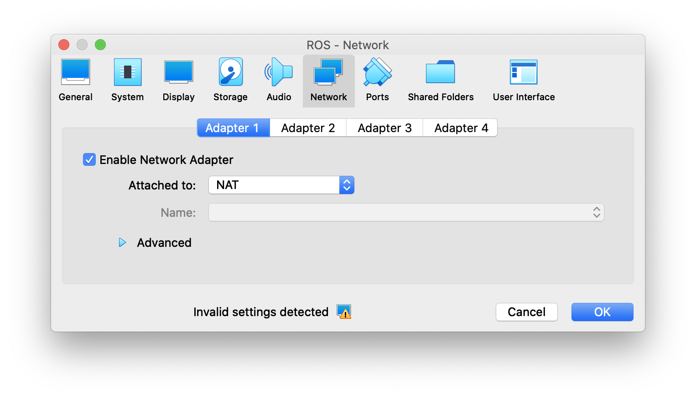
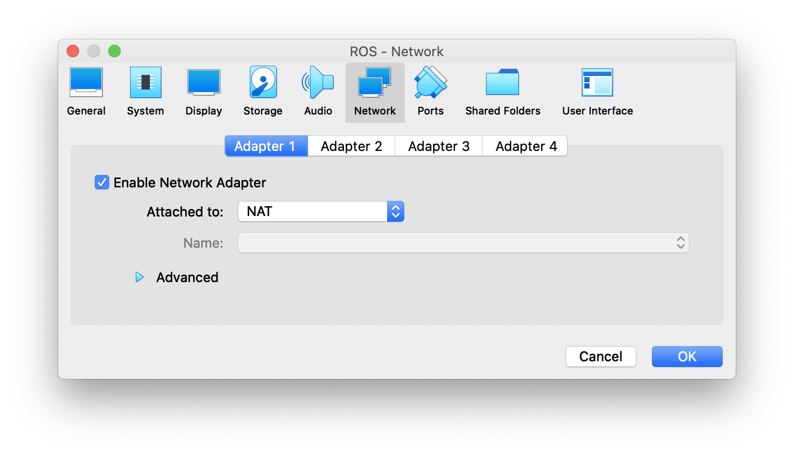
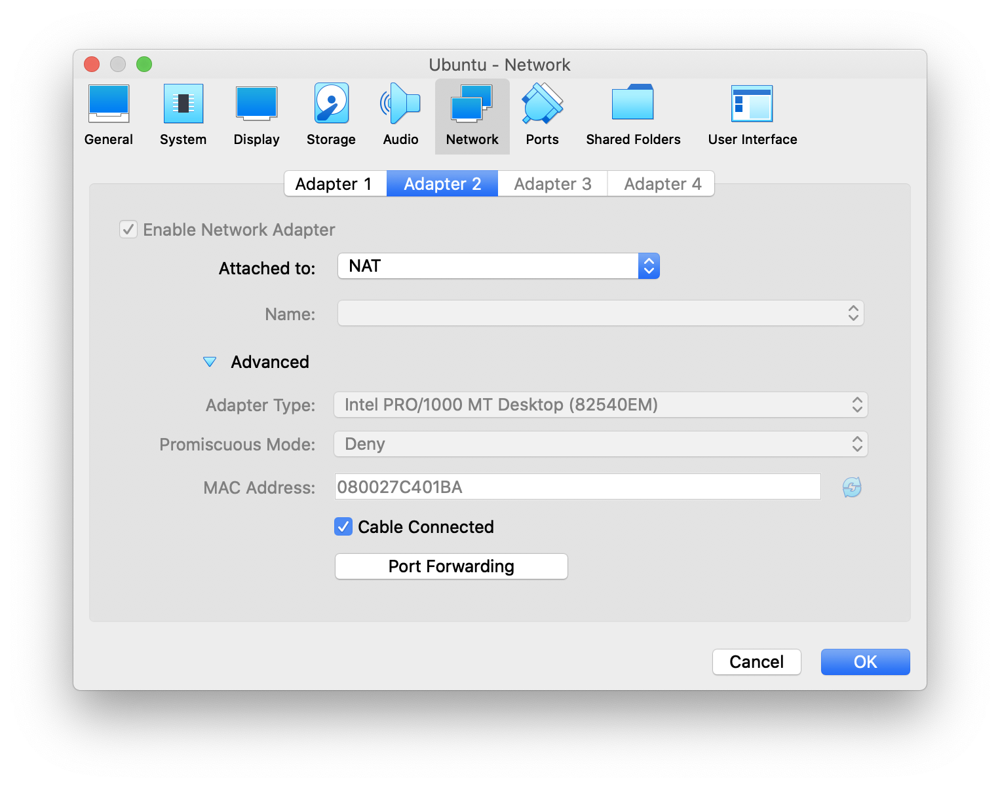
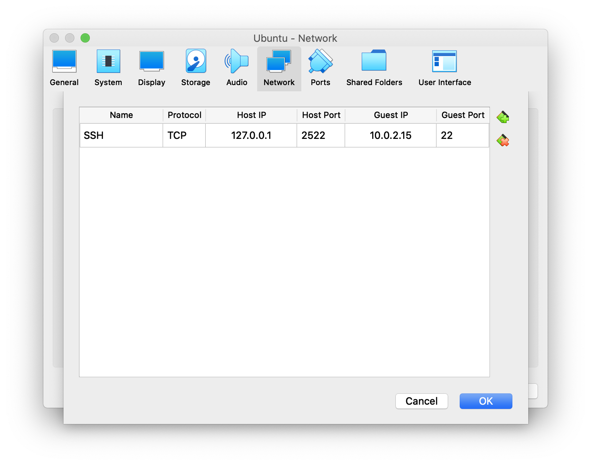
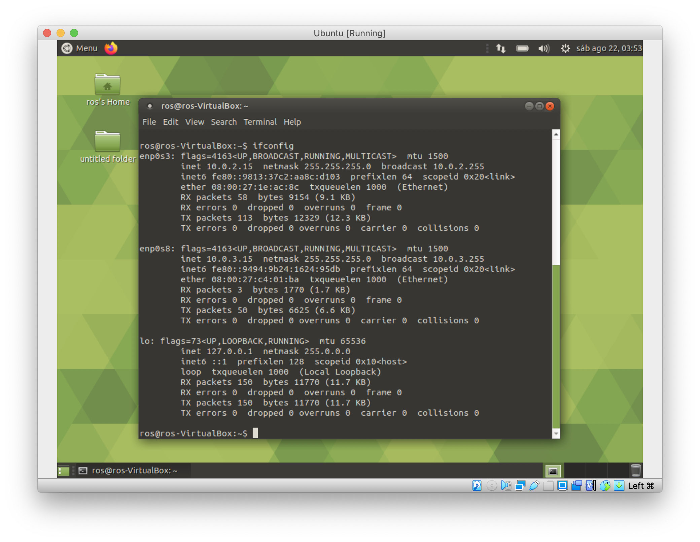
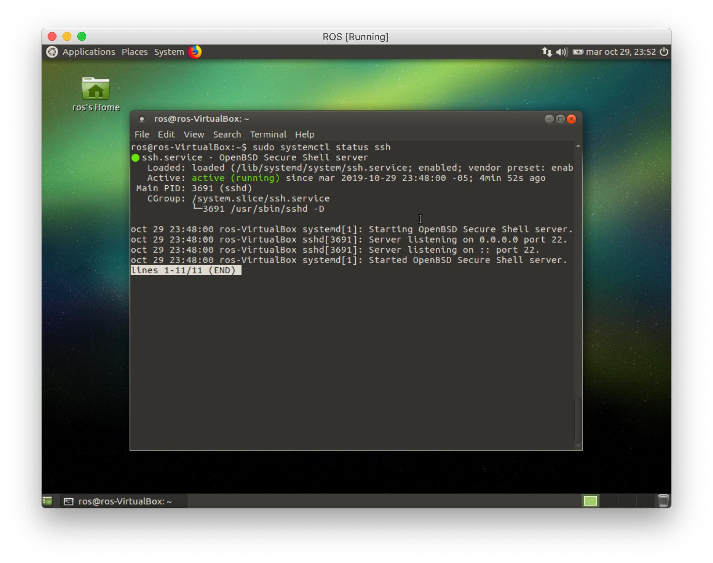
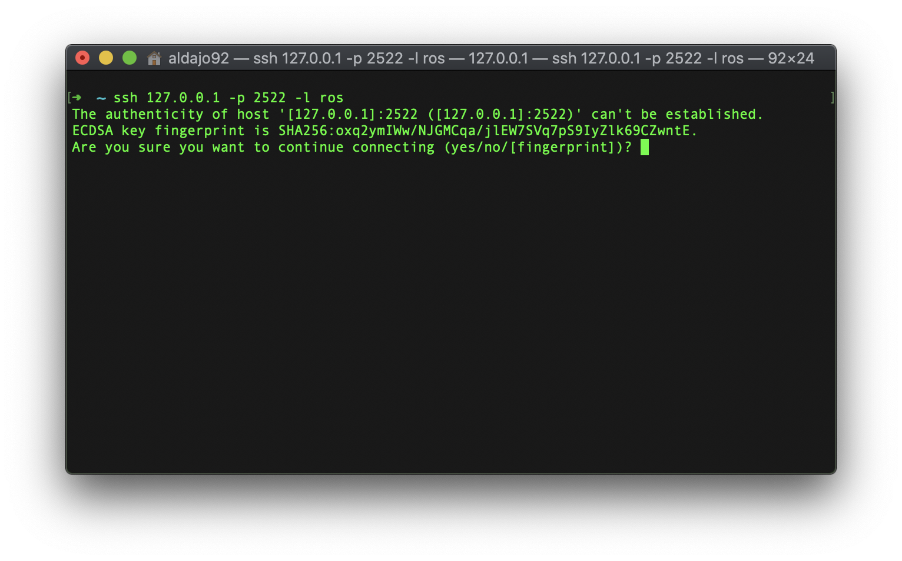
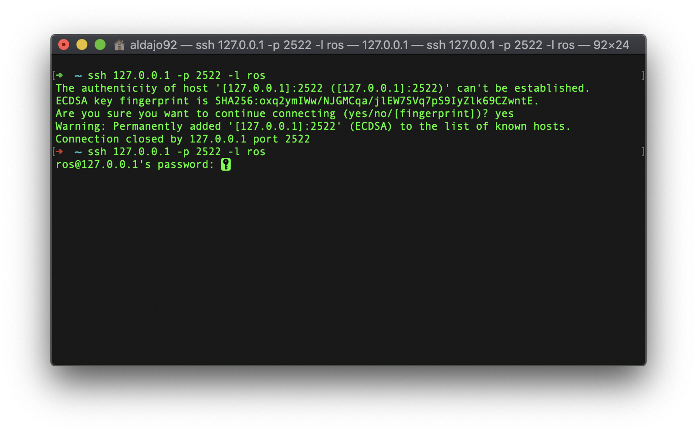
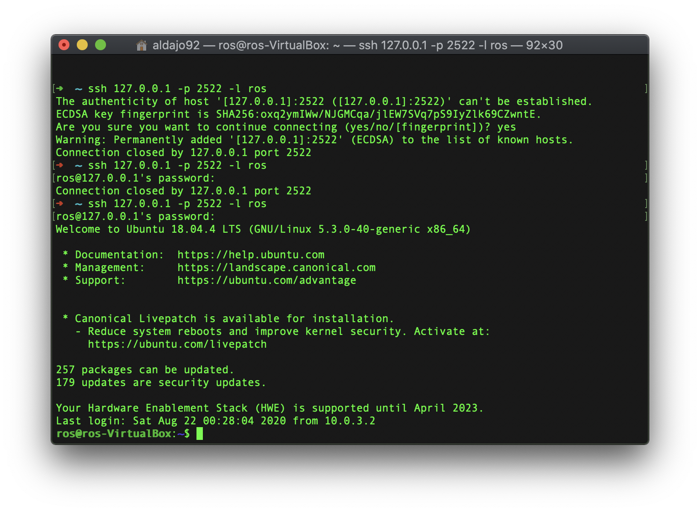
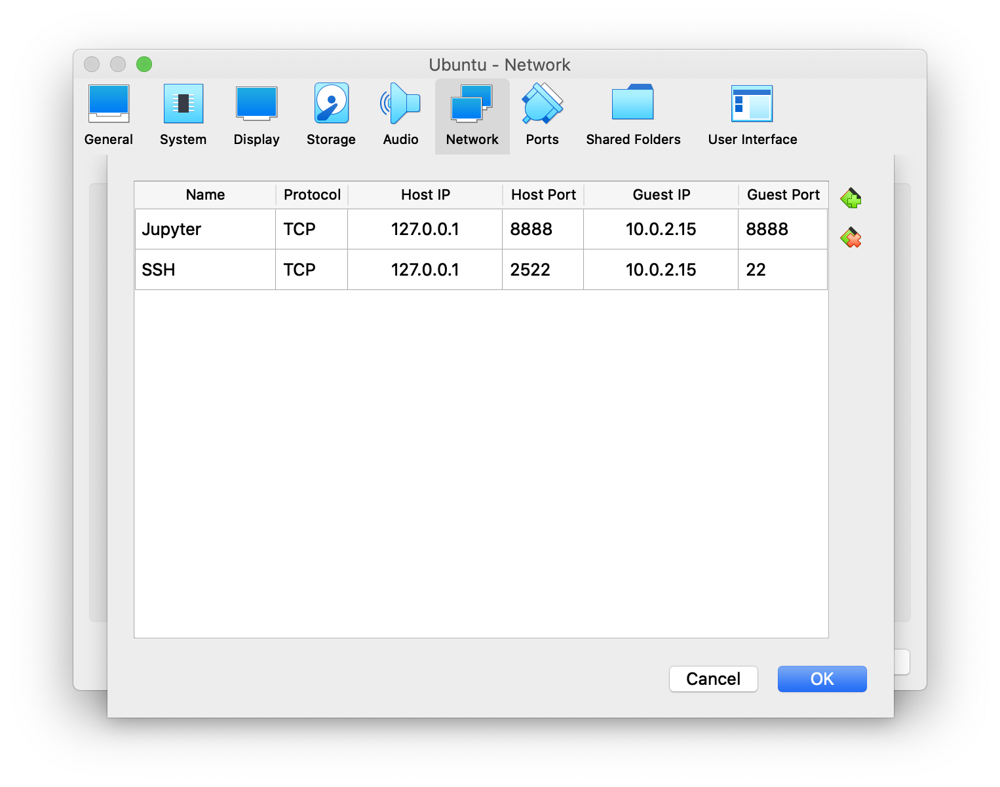

# Configuración SSH de la VM con Ubuntu MATE #

Una vez se tenga instalada la máquina virtual, configuramos la red de la misma entrando a la opción de configuración:




Luego, en la ventana seleccionamos la opción ```Network```:



Y seleccionamos la pestaña ```Adapter 2 ``` y habilitamos la casilla ```Enable Network Adapter```. Adicionalmente debemos desplegar y buscar en la sección ```Attached to``` la opción ```NAT```.



Luego, presionamos sobre el botón `Port Forwarding`. Y agregamos los siguientes campos en la ventana abierta:



Guardamos los campos con `OK`.

Finalizamos la configuracion de la red con el botón `OK`.

Corremos nuestra VM, iniciamos sesión y abrimos la consola con la combinación de teclas ```control + option + t``` y escribimos en ella:

```
~$ ifconfig
```

Que nos deberia desplegar algo como lo siguiente:



Debemos observar 3 interfaces de red: ```enp0s3```, ```enp0s8``` y ```lo```. Prestaremos atención a las dos primeras. Las interfáces de red `enp0s3` corresponde a la red que simula la conexión cableada y siempre esta por defecto (al igual que ```lo```). La interfáz ```enp0s8``` corresponde a una nueva conexion cableada que corresponde a la configurada previamente, y que nos servirá para comunicarnos externamente usando el protocolo ssh.

Procedemos ahora con la instalación del ```openssh-server``` en la VM, con las siguientes instrucciones usando la consola:

```
~$ sudo apt update
~$ sudo apt install openssh-server -y
```

Una vez la instalación a finalizado, el servicio SSH iniciará automáticamente. Para verificar que la instalación fue satisfactoria y el servicio SSH se encuentre en ejecución, escribimos el siguiente comando:

```
~$ sudo systemctl status ssh
```

(Presionando la tecla ```Q``` cerramos el proceso que queda abierto en la consola)



para mas información sobre la configuración SSH, revisar la siguiente [guía de instalación](https://linuxize.com/post/how-to-enable-ssh-on-ubuntu-18-04/).

Ahora, desde nuestra consola (la del equipo, por fuera de la VM) nos podremos conectar a la VM usando el protocolo SSH. Para ello usamos la ip que nos arroja el comando ```ifconfig``` en la interfáz ```enp0s8``` que se mostró previamente, usando la siguiente instrucción, reemplazando ```<username>``` por el nombre del usuario:

```
~$ ssh 127.0.0.1 -p 2522 -l <username>
```

Un ejemplo sería como el siguiente:

```
~$ ssh 127.0.0.1 -p 2522 -l ros
```



Luego nos pedira confirmación por la autenticidad de la conexión que vamos a establecer, escribimos ```yes``` para confirmar.

Al primer intento no pasará nada, solo registrará la ip a la lista de hosts conocidos. Volvemos a ingresar la misma instrucción y aquí si nos pedira la contraseña que definimos para el sistema operativo de nuestra VM:



Al ingresar la contraseña, ya tendremos nuestra consola conectada a consola del sistema operativo de la VM:



## Configuración JupiterLab ##

Instalar pip (En caso de no tenerlo):
```
$ sudo apt install python-pip
```

Instalar Jupyterlab:
```
$ pip install jupyterlab
```

Luego, realizar la siguiente configuración para conectarse a jupyterlab:

Generar un archivo de configuración `configuration`
```
$ jupyter-lab --generate-config
```
Configurar un password para jupyter
```
$ jupyter notebook password
```

El archivo generado se crea en la ruta `/home/pi/.jupyter/jupyter_notebook_config.py`

Editar el archivo generado usando:
```
$ nano /home/pi/.jupyter/jupyter_notebook_config.py
```

Descomentar y configurar las siguientes opciones (buscarlas en el orden alfabético):
```
- c.NotebookApp.allow_origin = '*'
- c.NotebookApp.ip = '10.0.2.15'
- c.NotebookApp.open_browser = False
```

Con esta configuración, es necesario levantar jupyterlab manualmente:
```
$ jupyter-lab
```

Finalmente ir a la configuración de la red del `Adapter 2` en VirtualBox, y en la opción `Port Forwarding`, agregar el puente para jupyterlab:



Ir al navegador de nuestro equipo y verificar el funcionamiento:

```
localhost:8888
```